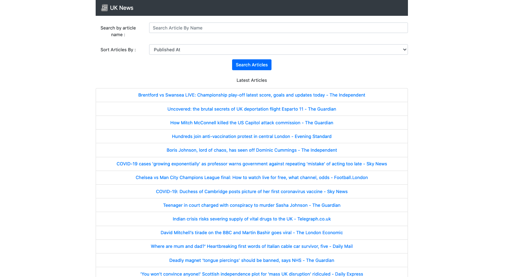
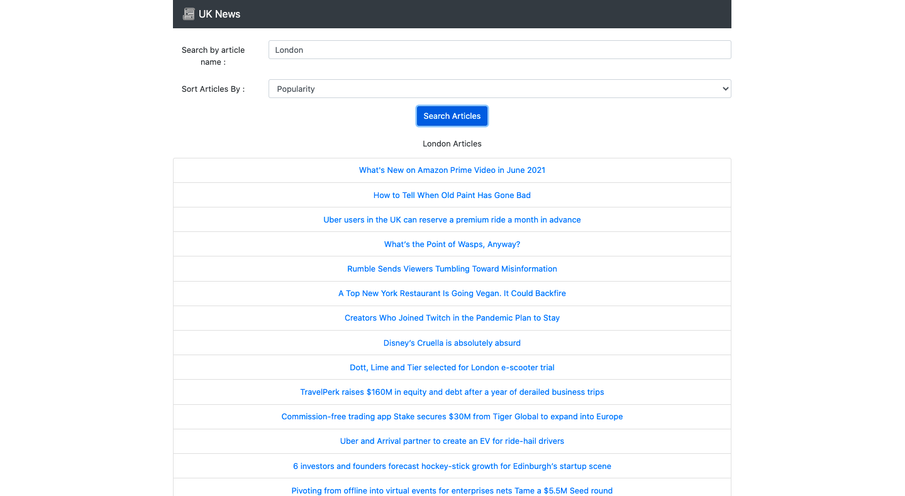

# conde-nast-test

## About
Its a complete Javascript based Application which loads latest news articles on home page. There are search and sort functionalities also. User can search the articles by keywords in the search box and also can sort them by : relevance, published date and popularity. 
Application is Responsive in nature and can interacted via mobile browser or desktop browser.

## Technologies Used
Front End : React, React Router, Bootstrap, Axios
Back End : Express, Axios, Cors, dotenv

## How to run the web application ?
Application is following REST architecture. Server and Client both are running on different ports. 
To run the application, clone the repo on system and then run <b>npm i & npm start</b> in both 'client' and 'server' folders.
Data is fetched from a third party API, there is no need to create an API Key to run the app, as one is already configured into the code base.

